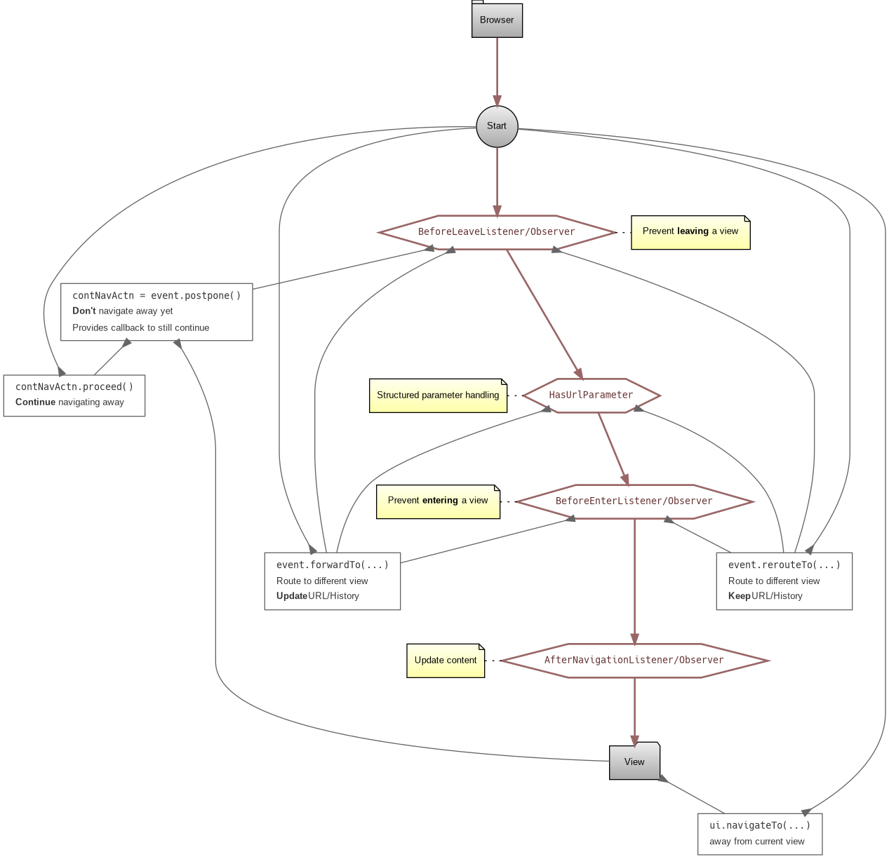

# Vaadin Flow cheat sheets

This project provides cheat sheets and flow diagrams for complex moving
parts of [Vaadin Flow](https://vaadin.com/flow).

The actual code of the project is used to trace events and try scenarios
the empirical way.

## Cheat sheets and diagrams

All diagrams and their source can be found inside the [`doc`
folder](./doc).  Needs [Graphviz](https://graphviz.org/) and [Baubotanik](https://github.com/christoph-frick/baubotanik)

### Navigation life cycle (routing and events)

